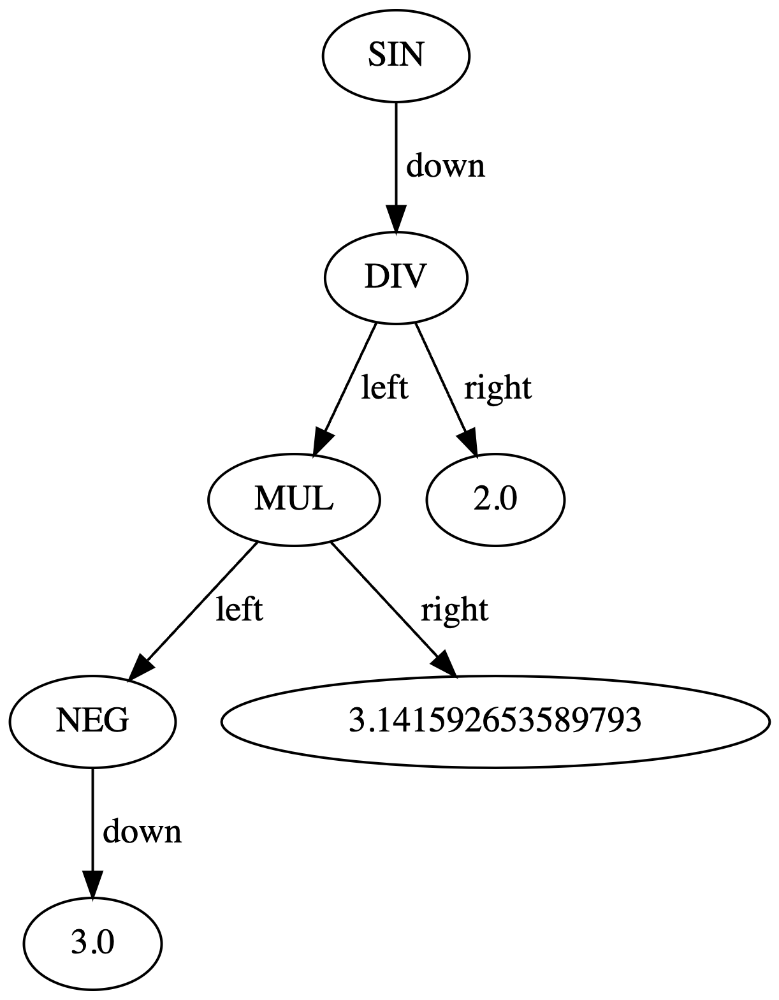

# Math Interpreter

**Math Interpreter** is a web application that accurately evaluates mathematical expressions, visualizing the underlying abstract syntax tree for better understanding of the expression's structure.

<!--  -->


*Sample output of the Math Interpreter for sin(-3 * pi / 2).*

## Features:

- **Tokenization**: Converts the input mathematical expression into tokens.
- **Parsing**: Transforms the list of tokens into an abstract syntax tree (AST).
- **Evaluation**: Computes the result of the expression based on its AST.
- **Visualization**: Renders the AST as a graphical tree using Graphviz.
- **Supported Operations**: Basic arithmetic (`+`, `-`, `*`, `/`, `^`), trigonometric functions (`sin`, `cos`, `tan`), and constants (`pi`).

## Setup & Installation:

1. Clone the repository:
   ```bash
   git clone https://github.com/lawsus/math-interpreter.git
   ```

2. Navigate to the project directory:
   ```bash
   cd math-interpreter
   ```

3. Install the required dependencies:
   ```bash
   pip install -r requirements.txt
   ```

4. Start the Flask application:
   ```bash
   python main.py
   ```

The application should now be running on a local server.

## Usage:

1. Navigate to the local server.
2. Enter a valid mathematical expression in the input field.
3. Click "Evaluate".
4. View the resulting value of the expression, the inorder traversal, and the visualized AST.

## Contribution:

Pull requests are welcome.
